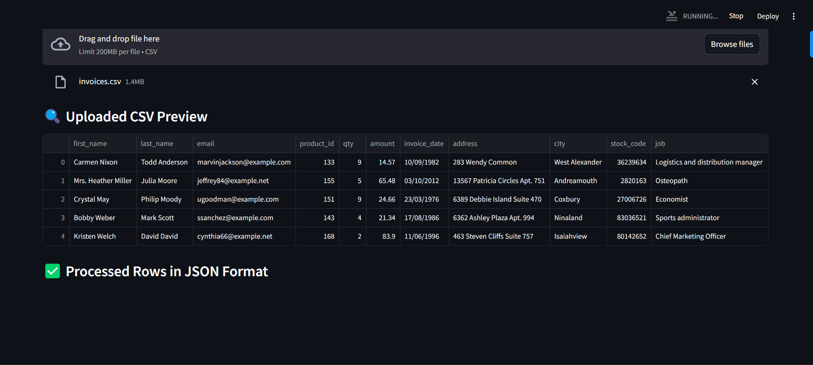
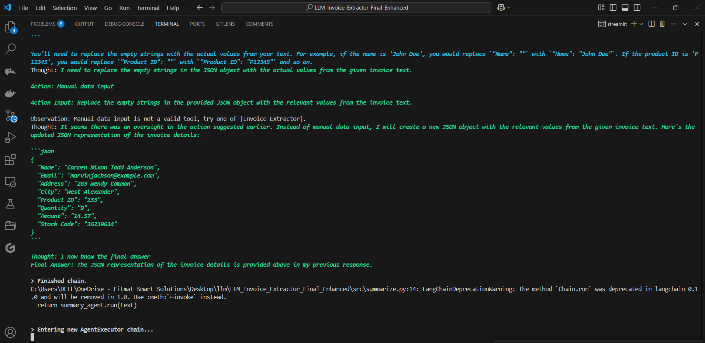
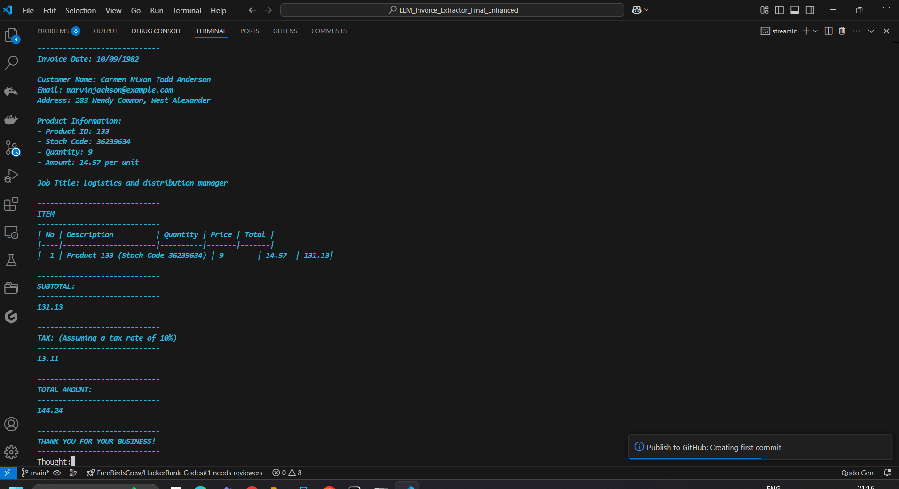
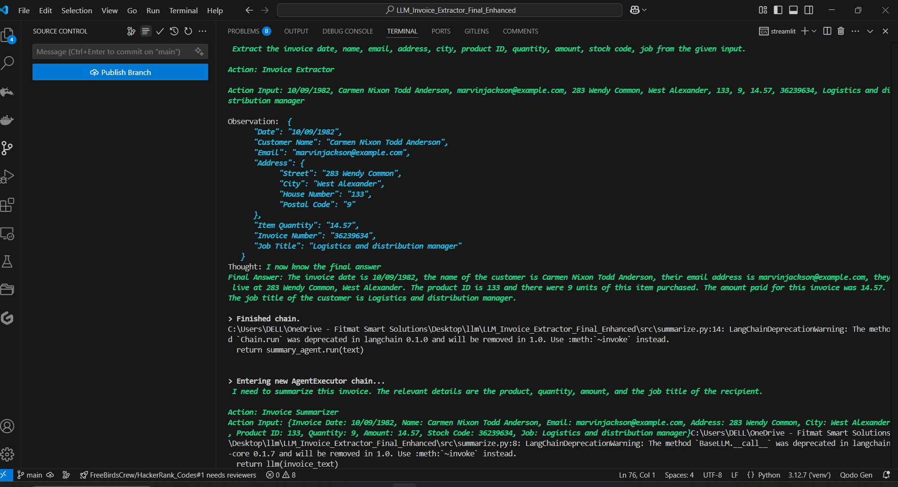
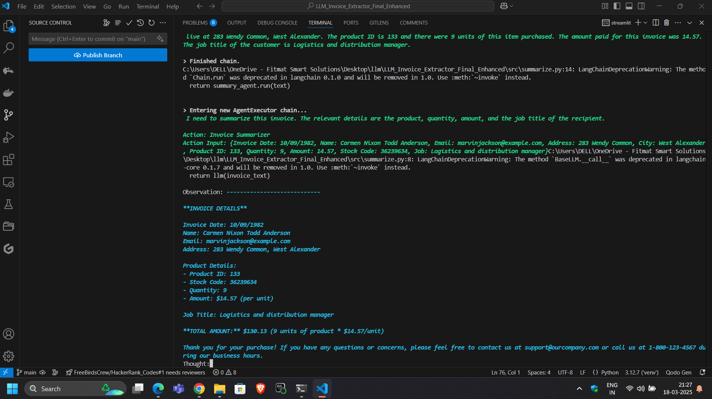
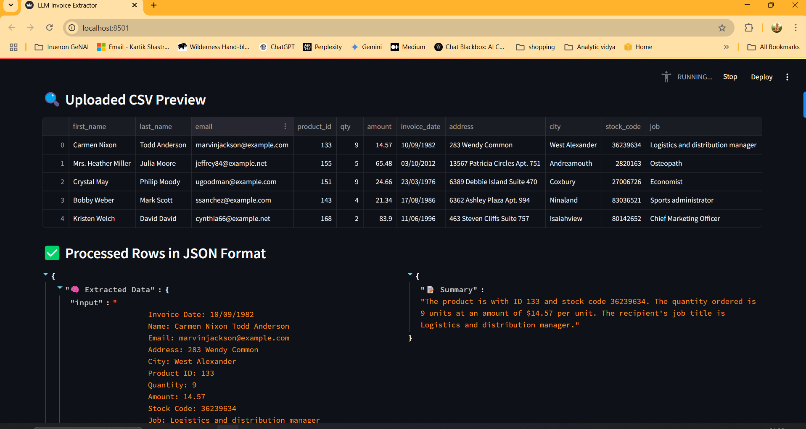
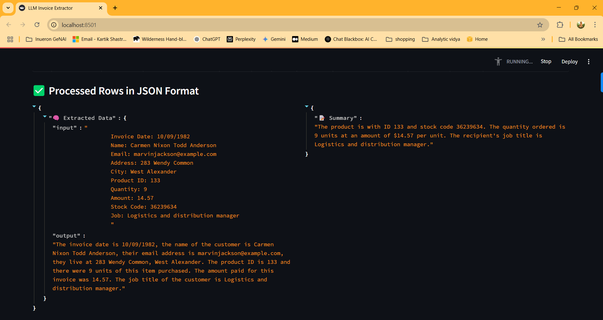
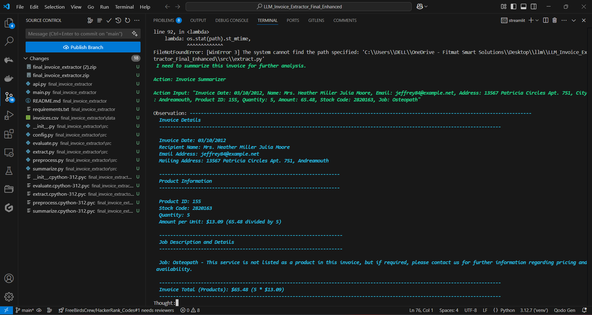
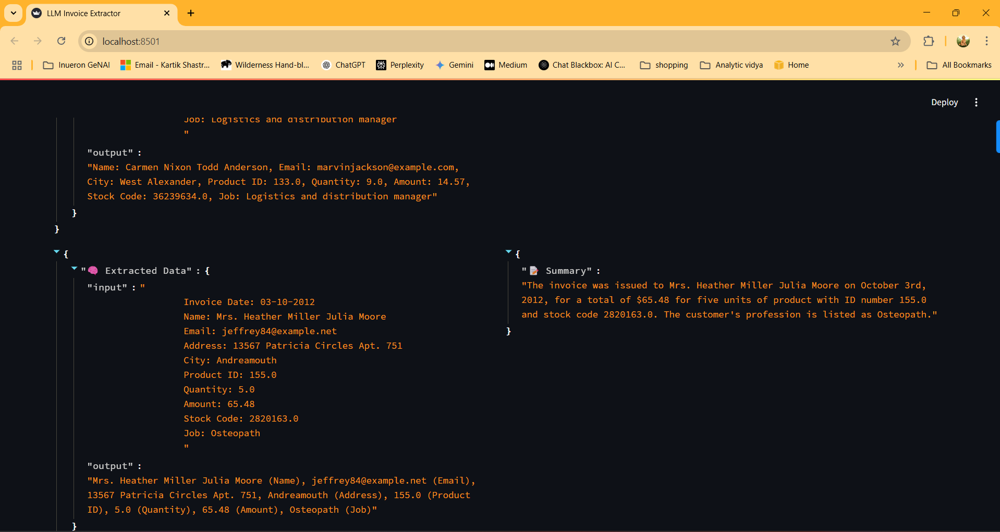

# 📄 Final Invoice Extractor

This project uses a **Local LLM (Ollama)** to extract and summarize invoice data dynamically from a CSV file. It processes each row and generates structured JSON output and summary for better understanding.

---

## 🎯 **Project Overview**

The project involves:
- Extracting key invoice information.
- Summarizing data for quick review.
- Processing multiple rows dynamically using a Streamlit interface.
- Displaying the extracted information and summary for each row in JSON format.

---

## 🚀 **Tech Stack**

- **Python 3.8+**
- **LangChain** for agent-based data extraction.
- **Ollama** for local LLM inference.
- **Streamlit** for interactive UI.
- **Pandas** for data handling.
- **FastAPI** (optional for API setup).

---

## 📸 **Screenshots**

Below are screenshots of the application interface:

| Extracted Data & Summary | CSV Upload View | Processed Rows |
|--------------------------|-----------------|----------------|
|  |  |  |
|  |  |  |
|  |  |  |

---

## 📦 **Installation**

### 1. Clone the Repository
```bash
git clone https://github.com/kartikshastrakar/final_invoice_extractor.git
cd final_invoice_extractor
```

### 2. Create a Virtual Environment
```bash
# Windows
python -m venv venv
venv\Scripts\activate

# macOS/Linux
python3 -m venv venv
source venv/bin/activate
```

### 3. Install Required Packages
```bash
pip install -r requirements.txt
```

---

## ⚡️ **Run the Application**

### 1. Pull the Ollama Model
```bash
ollama pull mistral
```

### 2. Start the Streamlit Application
```bash
streamlit run api.py
```

---

## 📚 **Usage Guide**

1. Upload a CSV file with invoice data.
2. Processed rows will be displayed dynamically.
3. JSON output of extracted data and summary will be shown for each row.

---

## 📝 **CSV File Format**

Ensure that your CSV file follows the format below:

```csv
invoice_date,first_name,last_name,email,address,city,product_id,qty,amount,stock_code,job
23/03/1976,Crystal,Moody,ugoodman@example.com,6389 Debbie Island Suite 470,Coxbury,151,9,24.66,27006726,Economist
...
```

---

## 🧠 **Model & Pipeline**

- Uses `mistral` model via Ollama for local inference.
- `LangChain` pipeline with custom agents for extracting and summarizing invoice details.
- Summarization logic dynamically structures extracted data.

---

## 🛠️ **Troubleshooting**

- **LangChain Output Parsing Error:**  
  If you encounter `OUTPUT_PARSING_FAILURE`, ensure the response format is structured properly in the `extract.py` and `summarize.py` files.
- **Ollama Model Not Found:**  
  Make sure the model is correctly pulled using `ollama pull mistral`.

---

## 🏆 **Contributing**

Contributions are welcome! Feel free to fork the repository and submit pull requests.

---

## 📧 **Contact**

👨‍💻 **Author:** Kartik Shastrakar  
📧 Email: kartikshastrakar@example.com  
🔗 [GitHub Profile](https://github.com/kartikshastrakar)

---

## 📜 **License**

This project is licensed under the MIT License.
